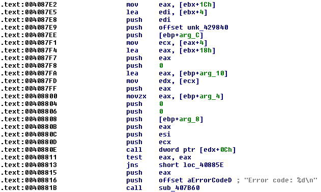
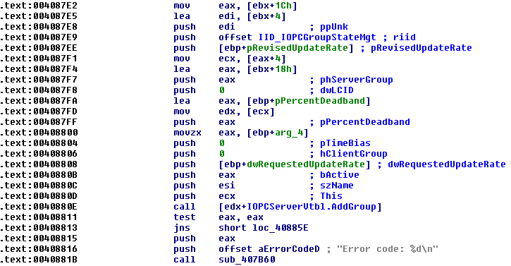

= OPC Data Access IDAPython script

An IDAPython script for IDA Pro that helps reverse engineer binaries that are
using the OPC Data Access protocol.

It can be used to analyse such malware families as **Havex RAT** and
https://www.welivesecurity.com/wp-content/uploads/2017/06/Win32_Industroyer.pdf[
**Win32/Industroyer**].

The script identifies CLSID, IID, and LIBID constants and creates structures
and enumerations. Afterwards, these structures can be used to annotate COM
method call parameters.

Example:

.Before

.After

